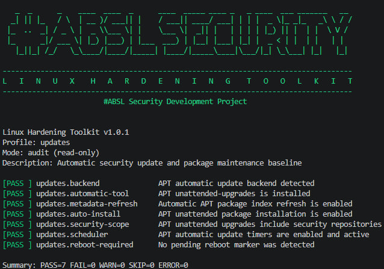
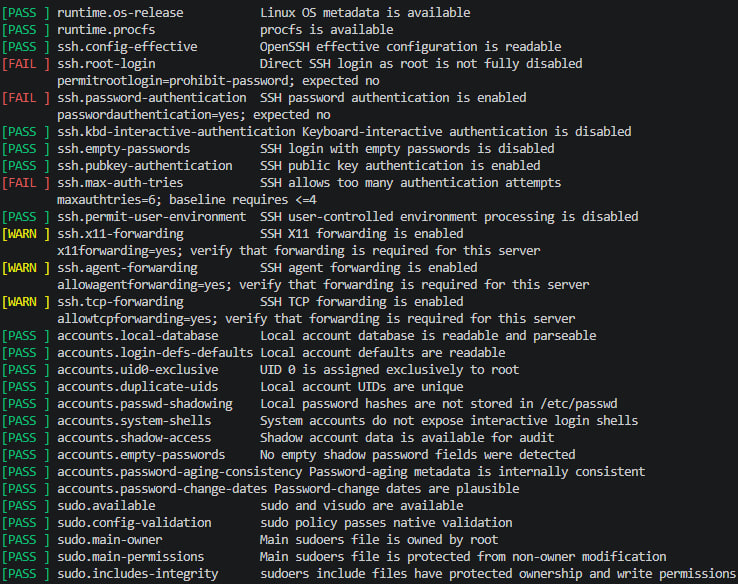

# Linux Hardening Toolkit

[](https://github.com/abyssalsec/linux-hardening-toolkit/actions/workflows/ci.yml)


<p align="center">
  
</p>

A modular, profile-driven and read-only Linux security auditing toolkit written in Bash.

Linux Hardening Toolkit evaluates the effective security state of a Linux host,
classifies findings using explicit result semantics, and supports both
human-readable terminal output and structured JSON reports.

The interactive CLI includes **#ABSL Security** branding while preserving clean
machine-readable and non-interactive output for automation.

## Highlights

- 96 checks in the default Linux server profile
- 11 built-in audit profiles
- read-only audit execution
- modular security-domain architecture
- profile-driven check selection
- `PASS`, `FAIL`, `WARN`, `SKIP`, and `ERROR` result states
- deterministic exit codes
- structured JSON reporting
- atomic report-file generation
- restrictive `0600` report permissions
- interactive `#ABSL Security` startup banner
- compact banner fallback for narrow terminals
- `--no-banner` support
- ShellCheck static analysis
- automated unit and integration tests
- GitHub Actions CI

## Screenshots

### Security audit

<p align="center">
  
</p>

### Audit findings

<p align="center">
  
</p>

## Quick start

Clone the repository:

```bash
git clone https://github.com/abyssalsec/linux-hardening-toolkit.git
cd linux-hardening-toolkit
```

Run the default audit:

```bash
sudo ./bin/linux-hardening-toolkit audit
```

Run a specific profile:

```bash
sudo ./bin/linux-hardening-toolkit \
  --profile ssh-server \
  audit
```

List registered checks:

```bash
./bin/linux-hardening-toolkit list-checks
```

Show the installed version:

```bash
./bin/linux-hardening-toolkit --version
```

## Interactive startup banner

When standard output is an interactive terminal, the toolkit displays the
`#ABSL Security` startup banner before human-readable audit output.

The full banner is used on sufficiently wide terminals. Narrow terminals
automatically receive a compact fallback.

Disable the banner explicitly:

```bash
./bin/linux-hardening-toolkit \
  --no-banner \
  audit
```

The banner is automatically suppressed for:

- JSON output
- redirected output
- shell pipelines
- version queries

This keeps scripting and machine-readable output clean.

## Result model

Every executed check returns one of five states:

| Status | Meaning |
| --- | --- |
| `PASS` | The evaluated security control satisfies the toolkit baseline |
| `FAIL` | A definite baseline violation was detected |
| `WARN` | A condition requires review but is not universally insecure |
| `SKIP` | The check is unavailable, not applicable, or cannot be meaningfully evaluated |
| `ERROR` | The check itself could not execute successfully |

This distinction is intentional.

Environment-dependent configuration is not automatically classified as a
vulnerability, and unavailable functionality is not silently treated as a
successful check.

## Profiles

| Profile | Checks | Purpose |
| --- | ---: | --- |
| `default` | 96 | Complete Linux server security baseline |
| `accounts` | 10 | Local account and password metadata |
| `audit` | 10 | Linux audit subsystem and security logging |
| `auth` | 8 | PAM and password authentication policy |
| `filesystem` | 10 | Sensitive file ownership and permissions |
| `firewall` | 6 | Host firewall and network exposure |
| `kernel` | 18 | Kernel and network runtime hardening |
| `services` | 7 | Network listeners and unnecessary services |
| `ssh-server` | 11 | OpenSSH server security |
| `sudo` | 7 | sudo policy syntax and configuration integrity |
| `updates` | 7 | Automatic security updates and package maintenance |

Example:

```bash
sudo ./bin/linux-hardening-toolkit \
  --profile firewall \
  audit
```

## Audited security domains

### OpenSSH

The OpenSSH profile evaluates effective server configuration rather than only
parsing individual configuration files.

Coverage includes:

- root login
- password authentication
- keyboard-interactive authentication
- empty passwords
- public-key authentication
- maximum authentication attempts
- user environment
- X11 forwarding
- agent forwarding
- TCP forwarding

### Local accounts

Account auditing evaluates:

- `/etc/passwd`
- `/etc/shadow`
- UID consistency
- duplicate UIDs
- password database integrity
- login shells
- empty passwords
- password aging
- password-change metadata

Shadow-dependent checks distinguish insufficient privilege from a definite
security failure.

### sudo

The sudo profile evaluates:

- sudo availability
- configuration syntax
- configuration ownership
- configuration permissions
- include-directory integrity
- include-file naming
- configuration writability

### Kernel and sysctl

Runtime kernel checks inspect the effective state exposed through `/proc/sys`.

Coverage includes:

- ASLR
- kernel pointer restrictions
- kernel log restrictions
- ptrace policy
- protected links and files
- IPv4 and IPv6 redirect handling
- source routing
- reverse-path filtering
- ICMP hardening
- TCP SYN cookies
- IP forwarding

### Host firewall

Firewall auditing detects common Linux firewall backends and distinguishes
host firewall policy from container-specific forwarding rules.

Supported backend detection includes:

- UFW
- firewalld
- nftables
- iptables

The profile also reviews:

- active firewall state
- default input policy
- default forwarding policy
- ruleset availability
- exposed listeners

### PAM and authentication

Authentication auditing reviews controls including:

- PAM stack availability
- null passwords
- password quality
- minimum password length
- password history
- failed-login lockout
- lockout policy
- password hashing

### Filesystem permissions

Filesystem auditing reviews sensitive files and selected filesystem trees for:

- ownership
- permissions
- SSH host-key protection
- world-writable files
- world-writable directories
- unowned files
- privileged SUID/SGID files

The scanner intentionally avoids treating every privileged binary as a
security vulnerability.

### Services and exposure

Service auditing evaluates:

- failed systemd units
- network listeners
- insecure remote-access services
- legacy file-transfer services
- discovery and RPC services
- inetd-style service managers

Normal client-side DHCP sockets are not classified as exposed network
services.

### Audit and logging

The audit profile reviews:

- systemd-journald
- persistent journal storage
- syslog
- log-file permissions
- auditd availability
- auditd runtime state
- kernel audit state
- loaded audit rules
- critical-path coverage
- auditd configuration

Dependent auditd checks are skipped when the audit subsystem is unavailable
instead of producing misleading secondary failures.

### Automatic security updates

The updates profile reviews automatic package maintenance and security update
configuration.

APT-based Debian and Ubuntu systems are evaluated for:

- unattended-upgrades
- package metadata refresh
- unattended installation
- security repository scope
- systemd update timers
- pending reboot state

DNF-based systems are also detected where equivalent controls can be
evaluated.

## Command-line interface

```text
linux-hardening-toolkit [options] <command>
```

Commands:

```text
audit
list-checks
version
help
```

Common options:

```text
--profile NAME
--format text|json
--output PATH
--dry-run
--no-color
--no-banner
-v, --verbose
-h, --help
--version
```

The `audit` command is read-only.

## Human-readable output

The default renderer is intended for interactive terminal use.

Example:

```text
[PASS ] updates.backend              APT automatic update backend detected
[PASS ] updates.automatic-tool       APT unattended-upgrades is installed
[PASS ] updates.metadata-refresh     Automatic APT package index refresh is enabled
...
Summary: PASS=7 FAIL=0 WARN=0 SKIP=0 ERROR=0
```

Show additional details:

```bash
sudo ./bin/linux-hardening-toolkit \
  --profile updates \
  --verbose \
  audit
```

Disable color:

```bash
./bin/linux-hardening-toolkit \
  --no-color \
  audit
```

Disable the startup banner:

```bash
./bin/linux-hardening-toolkit \
  --no-banner \
  audit
```

## Machine-readable JSON reports

Emit JSON to standard output:

```bash
./bin/linux-hardening-toolkit \
  --profile default \
  --format json \
  audit
```

Write JSON directly to a report file:

```bash
./bin/linux-hardening-toolkit \
  --profile default \
  --format json \
  --output report.json \
  audit
```

Report files are created atomically and use restrictive `0600` permissions.

The JSON document contains:

- schema version
- toolkit version
- profile metadata
- generation timestamp
- audit mode
- result counters
- process-equivalent exit code
- metadata and result information for every executed check

Example:

```json
{
  "id": "ssh.root-login",
  "category": "ssh",
  "severity": "high",
  "title": "SSH root login disabled",
  "status": "FAIL",
  "message": "SSH root login is permitted",
  "details": "permitrootlogin=yes",
  "remediation_available": false
}
```

The current report schema version is `1`.

## Exit codes

| Code | Meaning |
| ---: | --- |
| `0` | Audit completed without failed checks or execution errors |
| `1` | Toolkit, runtime, output, or check execution error |
| `2` | Audit completed successfully but one or more checks failed |

`ERROR` takes precedence over `FAIL`.

Warnings and skipped checks do not independently change the process exit code
to `2`.

This allows the toolkit to be used in automation without conflating security
findings with execution failures.

## Architecture

```text
linux-hardening-toolkit/
├── bin/
│   └── linux-hardening-toolkit
├── lib/
│   └── core/
│       ├── banner.sh
│       ├── bootstrap.sh
│       ├── log.sh
│       ├── profile.sh
│       ├── registry.sh
│       ├── report.sh
│       ├── runner.sh
│       ├── runtime.sh
│       └── utils.sh
├── modules/
│   ├── accounts/
│   ├── audit/
│   ├── auth/
│   ├── filesystem/
│   ├── firewall/
│   ├── runtime/
│   ├── services/
│   ├── ssh/
│   ├── sudo/
│   ├── sysctl/
│   └── updates/
├── profiles/
├── scripts/
│   └── lint.sh
├── tests/
│   ├── integration/
│   ├── lib/
│   ├── unit/
│   └── run.sh
├── CHANGELOG.md
├── LICENSE
├── README.md
└── VERSION
```

Security modules register checks with the core registry.

Each registered check contains:

- unique check ID
- category
- title
- severity
- audit function
- optional remediation function slot

Profiles select registered check IDs without duplicating their implementation.

The runner executes selected checks, normalizes results, calculates summary
state, and passes collected audit data to the selected renderer.

## Privilege model

The toolkit does not automatically elevate privileges.

Some checks work as an unprivileged user while others require access to
root-owned configuration or security metadata.

For a complete server audit:

```bash
sudo ./bin/linux-hardening-toolkit audit
```

When insufficient privilege prevents a meaningful evaluation, checks are
designed to distinguish that state from a confirmed baseline failure.

## Security baseline

Linux Hardening Toolkit does **not** claim official CIS certification,
CIS Benchmark conformance, or certification against another third-party
security standard.

The implemented checks represent explicit Linux security practices and
intentionally distinguish between:

- definite baseline violations
- environment-dependent security decisions
- insufficient audit privileges
- unavailable or non-applicable functionality
- audit execution errors

The toolkit is an auditing aid and not a substitute for system-specific threat
modeling, architecture review, or organizational security policy.

## Requirements

Runtime:

- Linux
- Bash 4.0 or newer

Development and testing:

- Python 3
- ShellCheck

## Testing

Run the complete test suite:

```bash
./tests/run.sh
```

Test coverage includes:

- Bash syntax validation
- registry behavior
- result handling
- exit-code behavior
- JSON serialization
- JSON report validation
- report permissions
- banner behavior
- CLI validation
- text rendering
- integration behavior

## Static analysis

Run ShellCheck:

```bash
./scripts/lint.sh
```

The lint script checks the executable, core libraries, security modules,
development scripts, and tests.

## Continuous integration

GitHub Actions runs independent jobs for:

```text
ShellCheck
Test Suite
```

The workflow executes on pushes and pull requests.

## Version 1.x scope

The current stable release line is intentionally **audit-only**.

Automatic remediation is not performed.

This keeps the stable baseline focused on predictable assessment, explicit
result semantics, and safe execution on real Linux systems.

## Roadmap

Possible post-1.0 development areas include:

- controlled remediation workflows
- pre-change configuration backup
- rollback support
- Ansible integration
- broader distribution-specific coverage
- additional security domains
- expanded automated test fixtures
- report schema evolution

## License

Released under the MIT License.

See [LICENSE](LICENSE).
